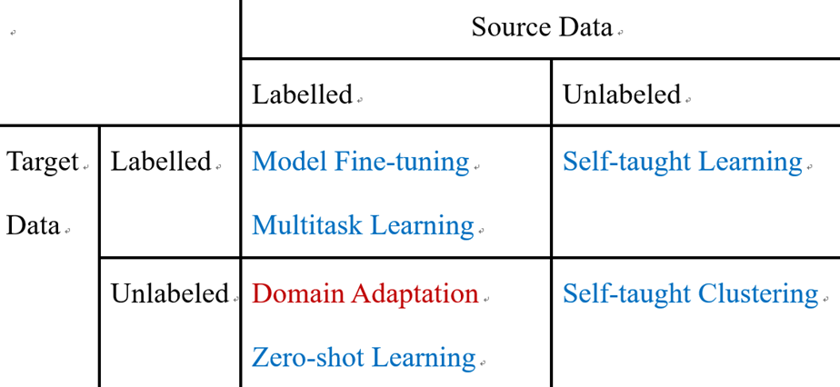

# AC-CV组 第一次组内分享

> 汇报人：魏 洁
>
> 日期：2021-10-14

## 1. 迁移学习

### 1.1 为什么会出现迁移学习？

- 监督学习需要大量的标注数据，但标注数据是一项枯燥无味且花费巨大的任务

- 一个模型往往难以满足个性化需求（不同人物需求），但每个模型都从0开始学习很费时费力

- 人在学习新知识时，往往是建立在大量基础知识之上的

	（认识一个猫，是从猫 = 耳朵 + 眼睛 + 爪子 + 毛茸茸 + ... ，而不是从什么是耳朵开始学起）

### 1.2 什么是迁移学习？

维基百科：

Transfer learning (TL): focuses on storing knowledge gained while solving one problem and applying it to a different but related problem.

简而言之：

- 将在某个领域或任务上学习到的知识或模式应用到不同但相关的其他领域或问题中。
- 目的：借用其他知识来提升某个特定任务的学习能力

举例说明：图片分类的模型可以被用来处理图片情感识别

### 1.3 相关概念

- **任务 Task**: 你当下想解决的问题，或者说你想让模型实现的功能
	- 比如：图片分类 和 情感分析 就是两个不同的任务

- **域 Domain **: 可以理解为某个时刻的某个特定领域，也可以狭义的理解为某个具体的数据集
	- 比如：图书评论 和 电影评论；中文语料库 和 英文语料库； 正常人脸 和 遮挡人脸

- 针对某一特定任务：
	- 源域（Source Domain）：可以是任何你可以获取到的数据集
	- 目标域（Target Domain）: 特定的，你要解决问题的数据集

### 1.4 迁移学习分类

按照源域数据和目标域数据是否有标注划分：

**1. 源域和目标域数据都有标注**，这是最常见的一种

- Model fine-tuning : 将已有比较成熟模型的参数加载到你当前的任务模型中作为初始化参数； 固定部分参数不训练，使用 target data 训练其他参数； or 全部参数都进行优化
- Multitask learning：将不同的任务放在一起，共用中间层捕捉共性，具体任务层分开训练，以提升多个任务的效果（解耦的思想）
- ......

**2. 源域数据有标注，目标域数据没有标注**

- Zero-shot learning：源域中从没有出现的类别，出现在目标域中（如训练数据只有猫狗，但测试数据出现老虎）。主流的两种处理方式：
	- 不直接进行分类，使用属性特征来表示每个 class，然后查表（字典）确定 class
	- 图片和属性特征同时进行 embedding，投影到一个空间， 然后判断哪两个 embedding vector 更接近
- Domain Adaptation

**3. 源域数据没有标注，目标域数据有标注**

用源域数据数据自监督学习得到一个较好的特征提取器，可以用于目标任务

待补充 ...

**4. 源域和目标域数据都没有标注**

待补充 ...

### 1.5 应用

视觉：图片分类

语音：不同语种的语音识别

文本：文本翻译

## 2. 领域自适应

### 2.1 问题提出

现在有一个手写体识别的任务，如 MNIST 数据集。我们只需要设计一个深度模型，然后在训练数据上进行训练，保存好模型参数，就可以在测试数据上得到一个比较好的效果。

**但是，**如果现在的测试数据和训练数据不完全一致，如测试图片是彩色背景，虽然数字形状是一致的，识别准确率却只有 57%。

这种情况是因为训练数据和测试数据的**分布不一致**，称为 Domain shift。

在这种情况下，我们如何训练模型，可以使得最终的结果更好一些呢， 引出了**领域自适应**相关技术。

### 2.2 任务描述

训练数据，有标签的数据，也称为源域数据

测试数据，没有标签，也称为目标域数据

现状是： 训练数据和测试数据分布之间存在不一致

目标是：如何使用这些数据帮助我们在 source domain 上训练 model，使其可以更好的用在 target domain

### 2.3 想法

以手写体识别为例，实际上识别过程可以分为两部分：1）特征提取器（如 CNN ，得到一个4096维的向量表示）；2） 分类器（如FC，判断到底是1，2，3···）

源域和目标域图片不一样，因此经过特征提取器后，得到的特征分布也不一样； 但如果特征提取器可以忽视掉输入图片不一样的地方（忽视掉域信息），只提取其中相同部分的信息，那么就可以得到相似的特征分布。这样，我们在源域上训练的分离器就可以直接用在目标域，并且可以获得较好的性能。

如何训练一个特征提取器，让 source 和 target 数据经过其得到的特征无法区分， 有一篇论文借鉴对抗学习的思想

### 2.4 域对抗训练

首先，源域数据有标注，所以经过特征提取器 + 类别预测，可以训练整个模型；

但是，目标域数据没有标注，无法完成模型的训练，此时如何使用这些目标域数据呢

因为我们希望source 和 target 数据经过特征提取器得到的特征无法区分，所以我们提出在特征提取器后面加上一个域分类器，让它来完成一个二分类任务，即该输入是来自源域还是目标域。

现在就出现了一个对抗的思想：

1. 我们刚说了，特征提取器目标是让经过它的数据得到的特征分布一致，无法区分
2. 但现在，域分类器的目标是，区分输入的特征是来自哪里

所以，域分类器任务是区分源域数据和目标域数据；特征提取器任务是欺骗分类器，但同时要保证提取到标签预测器所需要的特征，使标签预测器能够分辨出来数据类别

如何训练整个模型呢？

- 梯度反转层
- 交替训练

## 3. 参考资料

**Paper:**

[1] Y Ganin, Lempitsky V. Unsupervised Domain Adaptation by Backpropagation[C]. ICML, 2015.

[2] Gao Y , Liu J X , Wang L , et al. Domain-Adversarial Autoencoder with Attention Based Feature Level Fusion for Speech Emotion Recognition[C].  ICASSP, 2021.

**Video:**

<https://www.bilibili.com/video/BV1JE411g7XF?p=83>

<https://www.bilibili.com/video/BV1Wv411h7kN?p=71>

<https://www.bilibili.com/video/BV1T7411R75a?spm_id_from=333.999.0.0>

**Blog:**

<http://blog.itpub.net/69942346/viewspace-2654034/>

<https://blog.csdn.net/dakenz/article/details/85954548>

**Github**:

<https://github.com/jindongwang/transferlearning>

<https://github.com/jvanvugt/pytorch-domain-adaptation>
