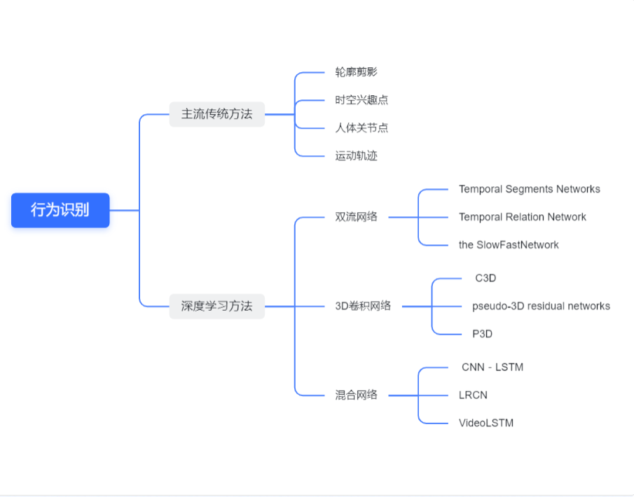
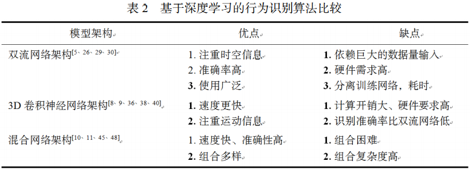
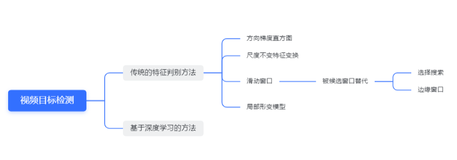

# Visual Understanding Overview

> AC-CV 组 第一次组内分享
> 汇报人：张硕、曹至欣
> 日期：2021-10-14

## 1. 所有方向汇总

- CVPR 2021 分方向整理： [CVPR2021-Paper-Code-Interpretation · GitHub](https://github.com/extreme-assistant/CVPR2021-Paper-Code-Interpretation/blob/master/CVPR2021.md#ActionRecognition)
- ICCV 2021 分方向整理： [ICCV 2021 paper with code · GitHub](https://github.com/DWCTOD/ICCV2021-Papers-with-Code-Demo#Face-Recognition)

## 2. 论文数量统计

- CVPR 2020 人脸汇总： [CVPR 2020 论文大盘点-人脸技术篇](https://bbs.cvmart.net/articles/2720)
- CVPR 2021/CVPR 2020/CVPR 2019/CVPR 2018/CVPR 2017 汇总： [CVPR2021/cvpr2020/cvpr2019/cvpr2018/cvpr2017-论文/代码/解读/直播合集](https://github.com/extreme-assistant/CVPR2021-Paper-Code-Interpretation)
- ICCV 2021 汇总： [ICCV 2021 paper with code](https://github.com/DWCTOD/ICCV2021-Papers-with-Code-Demo)

### 2.1. ICCV2021 CVPR2021 CVPR2020

| 方向                 | 数量 | 方向                       | 数量      |                      |           |
| ------------------ | -- | ------------------------ | ------- | -------------------- | --------- |
| 图像分类               | 3  | 图像分类                     | 5       |                      |           |
| Vision transformer | 41 |                          |         |                      |           |
| 目标检测               | 21 | 图像目标检测。视频目标检测            | 28 3    | 目标检测                 | 64        |
| 目标跟踪               | 8  | 目标追踪                     | 18      | 目标跟踪                 | 33        |
|                    |    | 图像分割                     | 14      | 图像分割                 | 25        |
|                    |    | 全景分割                     | 15      |                      |           |
| 图像语义分割             | 35 | 语义分割                     | 49      |                      |           |
| 实例分割               | 6  | 实例分割                     | 24      | 实例分割                 | 18        |
| 视频分割               | 4  | 视频目标分割                   | 12      | 全景分割和视频目标分割          | 8         |
| GAN                | 28 | GAN                      | 27      |                      |           |
| 零样本/小样本学习          | 16 | 小样本/零样本学习                | 11      |                      |           |
| 无监督                | 6  |                          |         |                      |           |
| 自监督                | 10 |                          |         |                      |           |
| 动作识别               | 8  |                          |         | 动作检测/动作分割 动作识别       | 13 21     |
|                    |    | 行为识别/动作识别/检测/分割/定位       | 25      |                      |           |
| 3D 姿势估计            | 9  | 姿态估计                     | 23      |                      |           |
| 人脸识别               | 6  | 人脸 人脸识别/检测 人脸生成/合成/重建/编辑 | 6 12 14 | 人脸技术： 人脸识别 人脸检测 人脸对齐 | 64 13 3 3 |
| 表情识别               | 2  |                          |         | 表情识别                 | 2         |
|                    |    | 图像/视频检索/理解               | 11      |                      |           |
| 行人重识别              | 12 | 行人重识别                    | 15      | 行人检测与重识别             | 33        |
| 人脸活体检测             | 3  | 人脸伪造+活体检测                | 6       |                      |           |
| deepfake           | 2  |                          |         |                      |           |
| 对抗攻击               | 6  |                          |         |                      |           |
| 超分辨                | 5  | 图像超分辨率                   | 10      | 超分辨率                 | 21        |
| HOI                | 4  | HOI 检测（人机交互检测）           | 7       |                      |           |
|                    |    | 图像异常检测                   | 7       |                      |           |
|                    |    | 图像编辑/图像修复                | 11      |                      |           |
|                    |    | 图像翻译                     | 9       |                      |           |
|                    |    | 图像/视频字幕                  | 7       |                      |           |
|                    |    | 表征学习                     | 19      |                      |           |
|                    |    | 视觉预测                     | 12      |                      |           |
|                    |    | 视觉推理/问答                  | 9       |                      |           |
|                    |    | 迁移学习/域适应                 | 24      |                      |           |

## 3. 研究方向详细

### 3.1. 1.视频

#### 3.1.1. 视频摘要

- **任务**：提取视频特征，提取关键帧（静态）视频片段进行拼接（动态）形成摘要
- **问题**：视频语义与特征信息的联系存在鸿沟
- **备注**：可以用语义分割，动作识别等方法进行研究，可用多模态方法进行视频摘要建模
- **在线视频摘要研究较少；多视图的视频摘要中多摄像机数据融合的问题亟待解决；数据集非常少且规模较小**

#### 3.1.2. 视频识别

##### 3.1.2.1. 行为识别/分类：（CVPR2021：行为识别/动作识别/检测/分割/定位:25 篇）

> 动作识别/视频理解

| **论文**                                                                                        | **关键词**                                                        |
| --------------------------------------------------------------------------------------------- | -------------------------------------------------------------- |
| A Baseline Framework for Part-level Action Parsing and Action Recognition                     |                                                                |
| Channel-wise Topology Refinement Graph Convolution for Skeleton-Based Action Recognition      | 骨架                                                             |
| Elaborative Rehearsal for Zero-shot Action Recognition                                        | Zero shot                                                      |
| FineAction: A Fined Video Dataset for Temporal Action Localization                            | 数据集                                                            |
| MultiSports: A Multi-Person Video Dataset of Spatio-Temporally Localized Sports Actions       | 数据集                                                            |
| Spatio-Temporal Dynamic Inference Network for Group Activity Recognition                      | 空间域 时间域 群体动作识别                                                 |
| Unsupervised Few-Shot Action Recognition via Action-Appearance Aligned Meta-Adaptation (Oral) | 无监督                                                            |
| Temporal Context Aggregation Network for Temporal Action Proposal Refinement                  | <https://zhuanlan.zhihu.com/p/358754602> 时序上下文聚合的动作提名修正网络 |

- **任务**：从一个未知的视频或图像序列中分析出正在进行的行为（简单的是对视频中某个动作正确地分类；复杂的视频中可能包含多个动作类别）
- **问题**：没有图像分类成熟，巨大类内方差，相机运动，背景干扰，数据不足；目前不存在一个算法适用所有行为的分类
- **思路**：
	1. 如何处理时间空间协调性，视频里动作的隔离分割（这个是研究的重点）
	2. 可以考虑引入注意力机制；
	3. 考虑全局语境信息成为重要方向；
	4. 可以考虑多模态信息融合
- **备注**：挑战较大，人体行为识别目前处在动作识别阶段
- **应用领域**： 机器人行为研究、智能人机交互、智能视 频监控、仿真虚拟现实、智能安防、运动员辅助训练
- **方法**：
	
	
	

#### 3.1.3. 行人重识别/行人搜索：

Anchor-Free Person Search <https://mp.weixin.qq.com/s/iqJkgp0JBanmeBPyHUkb-A>
**任务**：判断视频中是否存在特定行人，研究人的整体特征（检测行人位置，提取特征，特征匹配）
**问题**：无正脸照，配饰遮挡模糊光线。。。

#### 3.1.4. 视觉问答（计算机视觉与自然语言处理的交叉方向）

- **任务**：理解图像，根据问题做出回答（一般对图像和问题提取特征，多模态融合）
- **问题**：性能与提问方式有关（开放式问题难于评估），需要完全理解图像
- **备注**：比其他计算机视觉任务更具挑战性

#### 3.1.5. 视频描述/视频字幕（video caption）

> <https://zhuanlan.zhihu.com/p/118166500> <https://zhuanlan.zhihu.com/p/115354718> 视频描述生成综述

> Seq2Seq、注意力机制、GAN、增强学习、 Transformer

> 数据集：MSR-VTT, MSVD, ActivityNet

> 对 NLP 要有了解

> <https://zhuanlan.zhihu.com/p/30314440> Image Caption 深度学习方法综述

> <https://zhuanlan.zhihu.com/p/52499758> 图像描述

> <https://blog.csdn.net/m0_37052320/article/details/80947049>

> <https://zhuanlan.zhihu.com/p/77947067> 视频描述 信息

- **任务**：理解视频并学习更好的视觉表示，然后生成视频描述
- **问题**：当前方法主要是端到端，如何融合视频和语言是提升性能的关键
- **备注**：已经取得了不错的成绩，但视频的特征提取，时序特征，多语言文本描述(英文训练样本较多，其他较少）方面有很大的改进空间

#### 3.1.6. 视频分割

##### 3.1.6.1. 视频语义分割：

- **任务**：对视频中每帧的像素点进行分割成有特定语义的区域
- **问题**：在选择关键帧方面较主观；数据集较少（可考虑真实数据集与虚拟数据集结合）；
- **备注**：现有的方法都是在图像语义分割的基础上改进（可能需要考虑连续帧信息）

##### 3.1.6.2. 视频物体分割：

- **任务**：对视频中的像素划分成前景区域和背景区域，并生成对象分割 mask
- **问题**：运动模糊光照等问题；时序信息的利用（如何利用已分割序列帮助分割后续序列）；开放数据集有限；实时性较差
- **备注**：近几年研究进展显著，仍然存在一些问题（见上）

### 3.2. 人脸

#### 3.2.1. 人脸检测与识别

> 新的数据集、fake、生成、年龄、情感、极端条件下、活体检测、mask、

> 2021CVPR 人脸识别：<https://zhuanlan.zhihu.com/p/394701651>

> 人脸活体检测综述：<https://zhuanlan.zhihu.com/p/44904820>

> 人脸表情识别：<https://zhuanlan.zhihu.com/p/40572244>

> 人脸年龄估计：

| **论文**                                                                                                               | **关键词**                 |
| -------------------------------------------------------------------------------------------------------------------- | ----------------------- |
| WebFace260M: A Benchmark Unveiling the Power of Million-Scale Deep Face Recognition                                  | 数据集                     |
| ForgeryNet: A Versatile Benchmark for Comprehensive Forgery Analysis                                                 | **人脸伪造数据集**             |
| A 3D GAN for Improved Large-pose Facial Recognition                                                                  | **用于改善大姿势面部识别的 3D GAN** |
| When Age-Invariant Face Recognition Meets Face Age Synthesis: A Multi-Task Learning Framework                        | **多任务框架、针对年龄**          |
| MagFace: A Universal Representation for Face Recognition and Quality Assessment                                      | **用于人脸识别和质量评估的通用表示法**   |
| HLA-Face: Joint High-Low Adaptation for Low Light Face Detection                                                     | **低光数据下的人脸识别**          |
| Pseudo Facial Generation with Extreme Poses for Face Recognition                                                     | 极端姿势下的人脸识别              |
| Clusformer: A Transformer based Clustering Approach to Unsupervised Large-scale Face and Visual Landmark Recognition | Transformer 无监督         |
| SynFace: Face Recognition with Synthetic Data                                                                        | 使用生成人脸代替实际人脸            |

- 问题：光线表情年龄等，导致无法在现实生活中广泛应用；遮挡问题仍没有有效的解决办法

- **备注**：较为成熟的技术；跨模态以及多模态识别（能够克服单一模态识别的诸多问题，是一个重要的研究问题，难点在于如何利用各个模态的互补信息）；  近几年损失函数成为人脸识别领域最热门的的研究课题，未来一段时间仍会是人脸识别技术发展的方向；

- **需要注意的问题**：
	1. 如何有效解决卷积神经网络的局部最优问题从而高效达到全局最优，
	2. 训练数据集的主体多少和每个主体所拥有的图像数量如何达到最佳平衡点；
	3. 如何对更复杂的神经网络进行建模，当前难以对真正的生物神经系统进行建模

- **应用**： 安防、金融、教育、交通、新零售等领域

#### 3.2.2. 视频人脸识别

- **技术难点**：
	1. 人脸外观变化比图像更加剧烈（拍摄设备问题，外在条件 eg 光照等，拍摄对象不受控 eg 头部姿态，面部表情，遮挡）
	2. 需要对视频数据整体建模（一一比对两段视频所有帧效率低，所以需要整体建模）

- **方法**：

**深度学习的基于图像融合的建模方法（视频）**

| 论文                                                                                                       | 方法                                                                         |
| -------------------------------------------------------------------------------------------------------- | -------------------------------------------------------------------------- |
| Poolingfaces：Template based face recognition with pool 的 face （2016CVPR）                                 | 对视频中图像按照头部姿态划分成不同子集，经过姿态对齐后再提取特征                                           |
| Learning discriminative aggregation network for video-based face recognition（2017ICCV）                   | 利用 GAN 合成一张与所有视频帧尽可能贴近但更具辨别力的图像代表所有图像，再进行判别分析                              |
| Probabilistic face embeddings（2019ICCV）                                                                  | 将多个图像构成的视频分类问题看成联合条件概率估计，利用高斯分布对观察值采样的过程建模                                 |
| Quality aware network for set to set recognition（2017CVPR）                                               | 两个分支网络：一个提取每个人脸外观特征；一个估计每帧人脸图像的质量分数                                        |
| Neural aggregation network for video face recognition（2017CVPR）                                          | NAN（neural aggregation network),网络中级联两个注意力模块，第一级评估全局图像质量，第二级进一步得到基于图像的质量分数 |
| Discriminability distillation group representation learning(2020ECCV)                                    | 训练一个判别力蒸馏网络，过滤掉判别性较低的噪声样本，保留判别性较强的样本进行识别                                   |
| GhostVlAD forset-based face recognition  (2018ACCV)                                                      | 对所有图像深度特征进行聚类，之后基于聚类中心对同一视频的所有图像特征进行融合。                                    |
| Dependency-aware attention control for unconstrained face recognition with image sets(2018ECCV)          | 采用强化学习的方式，根据序列之间的相关关系抽取具有代表性的视频帧代表。                                        |
| Comparator networks (2018ECCV)                                                                           | 一种联合人脸检测及识别进行人脸校验的对比网络                                                     |
| Video face recogntion: Component-wise feature aggregation network (2019ICB）                              | 提出了更为细粒度的特征分量级的特征融合网络，将每个局部特征加权融合，降低噪声信息                                   |
| Permutation-invariant feature re-structuring for correlation-aware image set-based recognition（2019ICCV） | 将同一视频序列内其他视频帧特征对应位置的信息作为当前帧的残差特征进行重构                                       |

**视频数据集**：（全受限，半受限，非受限）

**CVPR2021 ICCV2021 人脸论文汇总**

| **CVPR2021**                                                                                                                                       |                              |
| -------------------------------------------------------------------------------------------------------------------------------------------------- | ---------------------------- |
| **人脸**                                                                                                                                             |                              |
| Continuous Face Aging via Self-estimated Residual Age Embedding(通过自我估计的残差年龄嵌入来实现连续的面部老化)                                                           | 图像 面部老化  生成                  |
| Towards High Fidelity Face Relighting with Realistic Shadows(逼真的阴影逼真的高保真面部)                                                                        | 图像  面部重打光                    |
| Unsupervised Disentanglement of Linear-Encoded Facial Semantics(线性编码的面部语义的无监督解缠)                                                                   | 图像  线性编码的面部语义解缠              |
| High-fidelity Face Tracking for AR/VR via Deep Lighting Adaptation(通过深度照明自适应实现 AR / VR 的高保真人脸跟踪)                                                   | 视频  面部运动转移方法（3D 逼真 AR、VR 化身） |
| Structure-Aware Face Clustering on a Large-Scale Graph with 10^7 Nodes(具有 10^7 个节点的大规模图上的结构感知人脸聚类)                                                 | 图像  人脸聚类                     |
| SDD-FIQA: Unsupervised Face Image Quality Assessment with Similarity Distribution Distance(具有相似分布距离的无监督人脸图像质量评估)                                   | 图像  人脸图像质量评估                 |
| **人脸识别/检测**                                                                                                                                        |                              |
| Dynamic Class Queue for Large Scale Face Recognition In the Wild(野外大规模人脸识别的动态类队列)                                                                  | 图像  野外大规模人脸识别                |
| Feature Decomposition and Reconstruction Learning for Effective Facial Expression Recognition(特征分解与重构学习对有效的面部表情识别)                                 | 图像（用到视频数据集中的数据） 面部表情识别       |
| FACESEC: A Fine-grained Robustness Evaluation Framework for Face Recognition Systems(FACESEC：用于人脸识别系统的细粒度鲁棒性评估框架)                                  | 图像  对人脸识别的细粒度鲁棒性评估           |
| IronMask: Modular Architecture for Protecting Deep Face Template(用于保护深脸模板的模块化体系结构)                                                                 | 图像  保护人脸模板                   |
| HLA-Face: Joint High-Low Adaptation for Low Light Face Detection(用于低光人脸检测的联合高低适应)                                                                  | 图像  弱光条件下的人脸识别               |
| Dive into Ambiguity: Latent Distribution Mining and Pairwise Uncertainty Estimation for Facial Expression Recognition(潜入歧义：面部表情识别的潜在分布挖掘和成对不确定性估计) | 图像  面部表情识别                   |
| Affective Processes: stochastic modelling of temporal context for emotion and facial expression recognition(情感过程：情感和面部表情识别的时态随机模型)                 | 视频  情绪识别                     |
| Cross-Domain Similarity Learning for Face Recognition in Unseen Domains(跨域相似性学习在未知领域中的人脸识别)                                                        | 图像  引入一种新的损失函数 人脸识别          |
| MagFace: A Universal Representation for Face Recognition and Quality Assessment(MagFace：人脸识别和质量评估的通用表示形式)                                          | 图像（在视频数据集上测试） 人脸识别           |
| CRFace: Confidence Ranker for Model-Agnostic Face Detection Refinement(用于模型不可知的面部检测细化的置信度排名)                                                       | 图像  人脸检测                     |
| A 3D GAN for Improved Large-pose Facial Recognition(用于改善大姿势面部识别的 3D GAN)                                                                           | 图像  改善姿势的人脸识别                |
| WebFace260M: A Benchmark Unveiling the Power of Million-Scale Deep Face Recognition(揭示了百万级深度人脸识别力量的基准测试)                                           | 构建了一个百万级人脸基准                 |

| **ICCV2021**                                                                                                                         |                             |
| ------------------------------------------------------------------------------------------------------------------------------------ | --------------------------- |
| **人脸识别**                                                                                                                             |                             |
| Masked Face Recognition Challenge: The InsightFace Track Report（蒙面人脸识别挑战: InsightFace 跟踪报告）                                          | 图像  戴口罩情况下的模型测试系统           |
| Masked Face Recognition Challenge: The WebFace260M Track Report（蒙面人脸识别挑战: WebFace260M 跟踪报告）                                          | 图像  戴口罩情况下 MFR 的基准          |
| PASS: Protected Attribute Suppression System for Mitigating Bias in Face Recognition（PASS:减少人脸识别偏差的保护属性抑制系统）                         | 图像（在视频数据集上测试） 阻止网络对敏感信息进行编码 |
| Rethinking Common Assumptions to Mitigate Racial Bias in Face Recognition Datasets（重新思考常见的假设，以减轻人脸识别数据集中的种族偏见）                       | 图像  减少人脸识别中的种族偏见            |
| SynFace: Face Recognition with Synthetic Data（SynFace:基于合成数据的人脸识别）                                                                   | 图像  基于合成数据的人脸识别             |
| Unravelling the Effect of Image Distortions for Biased Prediction of Pre-trained Face Recognition Models（揭示图像畸变对预先训练的人脸识别模型的偏差预测的影响） | 图像  图像失真对人脸识别的影响            |
| **面部表情识别**                                                                                                                           |                             |
| TransFER: Learning Relation-aware Facial Expression Representations with Transformers（TransFER:使用 transformers 学习关系感知的面部表情表示）        | 图像 使用 transformers          |
| Understanding and Mitigating Annotation Bias in Facial Expression Recognition（面部表情识别中标注偏误的理解与缓解）                                     | 图像  消除表达注释偏差                |

#### 3.2.3. 人脸活体检测

- **任务**：比较真实人脸和伪造人脸数据的差异进行伪造数据检测
- **问题**：数据集样本少，伪造数据制作成本高，姿势场景光照变化
- **备注**：因为基于 CNN 的方法泛化能力较差，基于域泛化的方法刚兴起不久是一个研究热点，泛化性能较深度学习方法有所提升        仍然处在发展阶段，大多数方法停留在研究阶段

针对泛化性能不足的问题，结合生成式对抗神经网络的域泛化技术是一个值得研究的方向
可以从扩大监测区域，从伪造攻击本身的行为特征入手

#### 3.2.4. 面部表情识别

- **任务**：从视频中检测出人脸部分，提取表情特征并进行分类
- **问题**：数据集对表情分类不够精细；数据集只标注表情标签，还应包括年龄种族等；人类表情复杂；现实中诸多因素
- **备注**：其他模态提供互补信息（语音，姿态，生理信号等）会使情感识别更准确

### 3.3. 图像处理

#### 3.3.1. **超分辨率**

- **任务**：从低分辨率图像上恢复出高分辨率图像
- **备注（未来可能发展的方向）**：改进网络结构（结合全局局部信息，结合低层高层信息，结合注意力机制；结构轻量化；找到最有效的损失函数是值得研究的方向；需要提出更准确的图像质量评估方法）

#### 3.3.2. 图像复原/图像增强

##### 3.3.2.1. **图像增强**

- **任务**：对图像不必要的细节进行抑制，增强整体效果或局部细节，改善图片质量
- **问题**：细节不足，色彩损失
- **备注**：现在还没有一种算法可以使增强图像各项指标达到最优化，只是在一定程度上实现平衡。

##### 3.3.2.2. **图像复原**

- **任务**：将退化的图像恢复成真实的原始图像
- **备注**：国内在这方面的研究才刚刚起步，国外已经取得了比较好的成果；如何选择合适的损失函数；减少噪声模型的深度，设计出更加完善的去噪模型

#### 3.3.3. 图像去噪/去模糊/去雨去雾(Image Denoising)

##### 3.3.3.1. **图像去噪**

- **任务**：利用图像序列的上下文信息去掉图片中的干扰噪声，提高图片的质量
- **问题**：去噪网络规模大，参数多，计算量大，训练不稳定
- **备注**：深度学习的方法对去噪声的泛化能力较差  以后可以从模型剪枝，知识蒸馏等方面构造更轻量的网络   无监督的去噪方法是以后值得研究的方向，针对真实噪声较有挑战性，如何将视频中各帧时序关系关联起来（当前主要集中在图像去噪）  利用模型压缩的方法在图像超分辨率重建上已有应用，图像去噪领域较少，是后续研究的方向

##### 3.3.3.2. **图像去模糊（图像运动模糊还原）**

- **任务**：将由于相机抖动、物体移动等造成的质量退化的图像还原
- **问题**：模糊核的估计对图像还原的影响；在扩大感受野的同时减少参数数量是提高运行速度的关键；模糊数据集的构建与获取存在一定难度。
- **备注**：大部分处理方法还是传统的两步方法： 先进行模糊核估计，再进行能量函数最小化。如何提升算法效率；如何构建新的数据集；网络结构的改进。

##### 3.3.3.3. **图像去雾**

- **问题**：缺少更加真实的数据集；当前较好的算法时间复杂度较高，很难应用到视频中；泛化能力缺乏
- **备注**：目前主要从图像增强，图像复原，CNN 三个方向进行。

##### 3.3.3.4. **图像去雨**

- **问题**：去雨的过程中会去掉背景的纹理细节；对于现实生活中雨滴形成雾的情况无法处理；实际场景性能差；数据集样本采集费时繁琐；视频实时数据还不能直接应用当前方法
- **备注**：如何将模型驱动和数据驱动结合；探索半监督，非监督学习和域适应；

#### 3.3.4. 图像编辑/图像修复

##### 3.3.4.1. **图像修复**

- **任务**：根据图像已知内容推测和修复破损和缺失的区域
- **备注**：极具挑战性的课题；基于深度学习的取得了瞩目的研究成果；当前主流方法是用 CNN 和生成对抗网络    如何提高模型对图像特征表达学习能力；如何建立高质量的单步修复模型替换多部修复；如何解决生成对抗网络的固有缺点；修复任务从分辨率低到高，高分辨率的细粒度修复是未来研究的热点

#### 3.3.5. **图像翻译**

- **任务**：将当前物体的图像表征转化为该物体另一种图像表征（白天到晚上，低像素到高像素，去除水印，梵高风格化。。。）
- **备注**：基于生成对抗网络的研究较为火热，引入注意力机制的方法也越来越多

### 3.4. 检测

- 目标检测

> [CVPR2021 2D 目标检测论文汇总](https://bbs.cvmart.net/articles/5120)

| **论文**                                                                    | **关键词**                         |
| ------------------------------------------------------------------------- | ------------------------------- |
| Towards Open World Object Detection                                       | 开放世界中的目标检测，可以检测未知的目标            |
| UP-DETR: Unsupervised Pre-training for Object Detection with Transformers | 使用 Transformers 进行目标检测的无监督预训练   |
| Improved Handling of Motion Blur in Online Object Detection               | 改进在线目标检测中运动模糊的处理                |
| Open-Vocabulary Object Detection Using Captions                           | 使用字幕的开放词汇目标检测                   |
| An End-to-End Transformer Model for 3D Object Detection                   | 基于端到端 Transformer 的 3D 点云目标检测模型 |
|                                                                           |                                 |

#### 3.4.1. **视频目标检测（需要用到跟踪算法）**

- **任务**：对视频中的目标进行定位和识别
- **问题**：优化主流目标检测算法的性能；模型轻量化；保持视频序列的时空一致性（运动模糊；未    聚焦上；遮挡；外观变化）
- **备注**：很多算法利用时间维度的信息提升性能；通过借鉴其他领域 eg.NLP 应用于视频目标检测也获得了不错的效果；    如何提升泛化性能；如何在少样本的情况下结合其他方法 eg.迁移学习，弱监督 进行目标检测
- **应用领域： **视频监控、自动驾驶、无人机导航
- **方法**：

**基于深度学习的方法**

#### 3.4.2. **人物交互检测（HOI）（知乎上论文解读较多）**

> 检测一张图片中，人对某个物体在做什么

> <https://zhuanlan.zhihu.com/p/395092992> 综述

| **论文**                                                                   | **关键词**             |
| ------------------------------------------------------------------------ | ------------------- |
| HOTR: End-to-End Human-Object Interaction Detection with Transformers    | Transformer end-end |
| Detecting Human-Object Interaction via Fabricated Compositional Learning | 使用结构化成分学习，解决长尾分布问题  |
| End-to-End Human Object Interaction Detection with HOI Transformer       | Transformer end-end |
|                                                                          |                     |

- **任务**：一张图片中人对某个物体在做什么，每个 HOI 都是一个<主语，谓语，宾语>三元组的形式，多标签分类问题（多个物体，多个人）
- **备注**：action recognition 做的比较饱和了，scene graph 任务的定义还不成熟（评价指标不统一，数据标注时只能关注物体之间的一种关系），相比来说 HOI 的任务定义更加清晰
- **当前方法**：two-stage（论文最多），one-stage（有两三篇文章，相比与 two-stage 或许有益于提高精度），end-to-end（方法最新,CVPR21 有 3-4 篇）

#### 3.4.3. **图像异常检测（还需要对异常区域进行定位）**

- **任务**：利用无标注样本或正常样本构建模型识别与期望模式存在异常的样本
- **问题**：（一般是在没有真实样本下进行模型训练）；异常样本未知性（一般仅有正常样本供使用）；异常定义不清晰；微小部分异常定位较难；处理高维数据性能还不太好（异常检测是从数据挖掘领域来的，多为针对低维数据）；模型泛化能力差
- **备注**：如何兼顾精度和实时性；考虑小样本学习和半监督学习；轻量化模型；如何针对图像自适应合成异常样本；

### 3.5. 分割

#### 3.5.1. **语义分割**

> <https://zhuanlan.zhihu.com/p/391483918> CVPR 2021 论文大盘点-语义分割篇

> 点云、域适应、半监督、弱监督、小样本、夜间

| **论文**                                                                                                   | **关键词**                    |
| -------------------------------------------------------------------------------------------------------- | -------------------------- |
| Differentiable Multi-Granularity Human Representation Learning for Instance-Aware Human Semantic Parsing | 解决 instance-aware 人体语义解析任务 |
| Cross-Dataset Collaborative Learning for Semantic Segmentation                                           | 计算单元、训练机制                  |
| PiCIE: Unsupervised Semantic Segmentation using Invariance and Equivariance in Clustering                | 新框架                        |
| Progressive Semantic Segmentation                                                                        | 高分辨率图像的多尺度分割框架             |
| Multi-Source Domain Adaptation with Collaborative Learning for Semantic Segmentation                     | 域适应语义分割                    |
| Source-Free Domain Adaptation for Semantic Segmentation                                                  |                            |
| Self-supervised Augmentation Consistency for Adapting Semantic Segmentation                              | 采用标准的数据增强技术                |
| Semantic Segmentation for Real Point Cloud Scenes via Bilateral Augmentation and Adaptive Fusion         | 点云语义分割                     |
| Rethinking BiSeNet For Real-time Semantic Segmentation                                                   | 实时语义分割                     |
| Anti-Adversarially Manipulated Attributions for Weakly and Semi-Supervised Semantic Segmentation         | 弱监督语义分割                    |
| Semi-Supervised Semantic Segmentation with Cross Pseudo Supervision                                      | 半监督语义分割                    |
| DANNet: A One-Stage Domain Adaptation Network for Unsupervised Nighttime Semantic Segmentation           | 夜间语义分割、对抗性训练               |
| Scale-Aware Graph Neural Network for Few-Shot Semantic Segmentation                                      | 小样本语义分割                    |

#### 3.5.2. **视频语义分割**

> 语义分割任务要求给图像上的每一个像素赋予一个带有语义的标签，视频语义分割任务是要求给视频中的每一帧图像上的每一个像素赋予一个带有语义的标签。

| **论文**                                                                     | **关键词** |
| -------------------------------------------------------------------------- | ------- |
| Domain Adaptive Video Segmentation via Temporal Consistency Regularization | 迁移学习    |
|                                                                            |         |

#### 3.5.3. **全景分割**

> <https://zhuanlan.zhihu.com/p/389697651> CVPR 2021 论文大盘点-全景分割篇

| **论文**                                                                               | **关键词**                         |
| ------------------------------------------------------------------------------------ | ------------------------------- |
| LPSNet: A lightweight solution for fast panoptic segmentation                        | one-stage 的方法：轻量级全景分割网络（LPSNet） |
| Cross-View Regularization for Domain Adaptive Panoptic Segmentation                  | 域适应全景分割                         |
| Toward Joint Thing-and-Stuff Mining for Weakly Supervised Panoptic Segmentation      | 弱监督全景分割                         |
| Part-aware Panoptic Segmentation                                                     | Part-aware 全景分割                 |
| ViP-DeepLab: Learning Visual Perception with Depth-aware Video Panoptic Segmentation | 视频全景分割                          |
| Exemplar-Based Open-Set Panoptic Segmentation Network                                | 开放集全景分割                         |
| LiDAR-Based Panoptic Segmentation via Dynamic Shifting Network                       | 用于点云领域的全景分割框架                   |

#### 3.5.4. **实例分割**

> 与语义分割的区别：语义分割是在像素级别上的分类，属于同一类的像素都要被归为一类，因此语义分割是从像素级别来理解图像的。比如说如下的照片，属于人的像素都要分成一类，属于摩托车的像素也要分成一类，除此之外还有背景像素也被分为一类。注意语义分割不同于实例分割，举例来说，如果一张照片中有多个人，对于语义分割来说，只要将所由人的像素都归为一类，但是实例分割还要将不同人的像素归为不同的类。也就是说实例分割比语义分割更进一步。

> 与目标分割的区别：目标分割有一个固定的目标，可以是由人指定的，也可以是计算机决定的，但是实例分割则是要计算每一个实例。

> 综述 <https://zhuanlan.zhihu.com/p/165135767>

> <https://jishuin.proginn.com/p/763bfbd29914>

> <https://zhuanlan.zhihu.com/p/110132002>

| **论文**                                                                                 | **关键词**                 |
| -------------------------------------------------------------------------------------- | ----------------------- |
| DCT-Mask: Discrete Cosine Transform Mask Representation for Instance Segmentation      | 新的掩码表示：DCT-Mask         |
| Simple Copy-Paste is a Strong Data Augmentation Method for Instance Segmentation       | Copy-Paste 数据增强方法       |
| FAPIS: A Few-shot Anchor-free Part-based Instance Segmenter                            | 基于 part 的小样本无锚实例分割器     |
| Deeply Shape-guided Cascade for Instance Segmentation                                  | 增加形状指导改进基线              |
| A^2-FPN: Attention Aggregation based Feature Pyramid Network for Instance Segmentation | 基于注意力聚合的特征金字塔网络 A^2-FPN |
| Zero-Shot Instance Segmentation                                                        | 零样本实例分割                 |
| Deep Occlusion-Aware Instance Segmentation with Overlapping BiLayers                   | 双图层实例分割                 |
| Weakly Supervised Instance Segmentation for Videos with Temporal Mask Consistency      | 弱监督实例分割                 |
| Incremental Few-Shot Instance Segmentation                                             | 小样本实例分割                 |
| Point Cloud Instance Segmentation using Probabilistic Embeddings                       | 点云实例分割                  |

#### 3.5.5. **视频实例分割 VIS**

> 视频的实例分割指的是对视频中感兴趣的物体进行检测、分割和跟踪的任务

> VIS 简单 综述<https://blog.csdn.net/weixin_42339975/article/details/104396041>

> 计算量大、数据集多、结合 tran 的话可能会很夸张，但是现在比较少，并且感觉用得上？

> 老式的针对第一帧进行分割，然后向后传播。或者对每一帧进行分割，然后进行关联。

> end to end

| **论文**                                                             | **关键词**                                                                                                   |
| ------------------------------------------------------------------ | --------------------------------------------------------------------------------------------------------- |
| End-to-End Video Instance Segmentation with Transformers           | <https://zhuanlan.zhihu.com/p/342149932> 利用 Transformer 实现的端到端的视频实例分割。将视频是做一个序列，对于类的追踪可以通过 tran 来实现。 |
| Hierarchical Memory Matching Network for Video Object Segmentation | demo：https://[www.bilibili.com/video/BV1Eg41157q3](http://www.bilibili.com/video/BV1Eg41157q3)            |
|                                                                    |                                                                                                           |

#### 3.5.6. **视频目标分割**

> <https://zhuanlan.zhihu.com/p/393216036>  视频实例分割任务 VIS 和 VOS MOTS 等区别

> <https://zhuanlan.zhihu.com/p/391788561> CVPR 2021 论文大盘点-视频目标分割篇

> <https://zhuanlan.zhihu.com/p/106087055> 视频目标分割研究小结

> 数据集：DAVIS、GyGO

> 内存占用会不会很大？

| **论文**                                                                                                      | **关键词**                            |
| ----------------------------------------------------------------------------------------------------------- | ---------------------------------- |
| Learning to Recommend Frame for Interactive Video Object Segmentation in the Wild                           | 关键帧选择问题表述为 Markov Decision Process |
| Guided Interactive Video Object Segmentation Using Reliability-Based Attention Maps                         | 注意力模块 减少交互时间                       |
| SSTVOS: Sparse Spatiotemporal Transformers for Video Object Segmentation                                    | 基于 Transformer 的 VOS               |
| Delving Deep into Many-to-many Attention for Few-shot Video Object Segmentation                             | 小样本视频目标分割 FSVOS                    |
| Learning Dynamic Network Using a Reuse Gate Function in Semi-supervised Video Object Segmentation           | 半监督 VOS                            |
| Reciprocal Transformations for Unsupervised Video Object Segmentation                                       | 无监督视频目标分割 UVOS                     |
| Target-Aware Object Discovery and Association for Unsupervised Video Multi-Object Segmentation              | 无监督 VMOS                           |
| SG-Net: Spatial Granularity Network for One-Stage Video Instance Segmentation                               | 单阶视频实例分割                           |
| Modular Interactive Video Object Segmentation: Interaction-to-Mask, Propagation and Difference-Aware Fusion | 交互式视频目标分割                          |
| Learning to Recommend Frame for Interactive Video Object Segmentation in the Wild                           | 交互式视频目标分割                          |
| Full-Duplex Strategy for Video Object Segmentation                                                          | 全双工识别 视频目标检测                       |

#### 3.5.7. **交互式视频目标分割**

> 用户选取需要进行分割的目标，后续跟踪这个目标进行分割

| **论文**                                                                                                      | **关键词** |
| ----------------------------------------------------------------------------------------------------------- | ------- |
| Modular Interactive Video Object Segmentation: Interaction-to-Mask, Propagation and Difference-Aware Fusion |         |
| Learning to Recommend Frame for Interactive Video Object Segmentation in the Wild                           |         |

### 3.6. 两种热门的方法

#### 3.6.1. Transformer

> 数据量和算力要求很大

> transformer 应用综述：<https://zhuanlan.zhihu.com/p/339181742>

> transformer 讲解：<https://zhuanlan.zhihu.com/p/308301901>

> Swin Transformer: 分层简化的 transformer

> transformer 变体综述 <https://arxiv.org/pdf/2106.04554.pdf>

> 对 DETR 的提升、3D 目标检测、动作识别、多模态、群体动作识别、医学图像、Spatio-Temporal Transformer、人体行为预测、点云、视频场景图生成、提升 YOLOv5、

> <https://zhuanlan.zhihu.com/p/360349869>

| **论文**                                                                    | **关键词**                                                                                                                                                                                                                                                        |
| ------------------------------------------------------------------------- | -------------------------------------------------------------------------------------------------------------------------------------------------------------------------------------------------------------------------------------------------------------- |
| End-to-End Video Instance Segmentation with Transformers                  | <https://zhuanlan.zhihu.com/p/342149932> 利用 Transformer 实现的端到端的视频实例分割                                                                                                                                                                                          |
| UP-DETR: Unsupervised Pre-training for Object Detection with Transformers | 使用 Transformers 进行目标检测的无监督预训练                                                                                                                                                                                                                                  |
| End-to-End Human Object Interaction Detection with HOI Transformer        | 使用 HOI Transformer 进行端到端的人类对象交互检测                                                                                                                                                                                                                              |
| Pre-Trained Image Processing Transformer                                  | 底层视觉预训练模型 [解读-Transformer 再下一城！](https://mp.weixin.qq.com/s?__biz=MzI5MDUyMDIxNA==&mid=2247524529&idx=1&sn=e39e67981b2afd9a5369cc843ddf28fe&chksm=ec1c8d48db6b045e7cf2d37c5633da8d3caf5e53178fe6df0913f2a04bc143fcc2e504d6f9be&token=2008688100&lang=zh_CN#rd) |
| Multi-Modal Fusion Transformer for End-to-End Autonomous Driving          | 用于端到端自动驾驶的多模态融合 Transformer                                                                                                                                                                                                                                    |
| ViLT                                                                      | 最简单的多模态 Transformer <https://zhuanlan.zhihu.com/p/369733979>                                                                                                                                                                                                   |
| LoFTR: Detector-Free Local Feature Matching with Transformers             | 图像特征匹配 LoFTR：与变压器互不影响的无检测器局部特征)                                                                                                                                                                                                                                |
| An End-to-End Transformer Model for 3D Object Detection                   |                                                                                                                                                                                                                                                                |
| AutoFormer: Searching Transformers for Visual Recognition                 | 自动寻找合适的 Transformer                                                                                                                                                                                                                                            |
|                                                                           |                                                                                                                                                                                                                                                                |

#### 3.6.2. 域适应

> 域适应是计算机视觉的一个领域，我们的目标是在**源数据集**上训练一个神经网络，并确保在显著不同于源数据集的**目标数据集**上也有良好的准确性。

> 迁移学习

### 3.7. 点云

<https://zhuanlan.zhihu.com/p/344635951> 关于点云的综述
