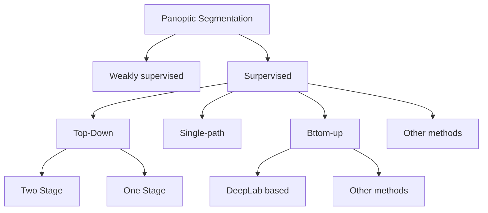

# A survey on deep learning-based panoptic segmentation

> 发表在爱思唯尔 Digital Signal Processing，综述的内容是基于深度学习方法的全景分割综述。文章首先介绍了全景分割的定义和背景，之后从四个方面总结了常见的全景分割方法，接下来介绍了全景分割的数据集和评价指标，并对之前提到的方法进行了总结，最后提出了全景分割的现存的问题与展望。
>
> 参考网站：https://zhuanlan.zhihu.com/p/59141570、https://zhuanlan.zhihu.com/p/67995445、https://www.cnblogs.com/vincent1997/p/10932949.html

## 1. Introduction

全景分割最先由 FAIR（KaiMing He） 与德国海德堡大学在2018年联合提出，其任务的具体分割形式有以下两点要求：

- 图像中的每个像素点都有**一个对应的语义类别**和**一个实例id**，如果无法确定可以给予空标注。
- 所有语义类别要么属于**stuff(不可数的背景事物)**，要么属于**things(可数的具体事物)**，不能同时属于二者；且stuff类别没有实例id（即id统一为一个）。

关于语义分割和实例分割：

在计算机视觉中，图像语义分割（Semantic Segmentation）的任务是预测每个像素点的语义类别；实例分割（Instance Segmentation）的任务是预测每个实例物体包含的像素区域。下图展示了三者的区别：

全景分割和图像语义分割与实例分割有着很密切的关系，具体来说：

- 对语义分割来说，如果所有的类别都是stuff，那么全景分割除了度量与语义分割不同外，其它相同。（语义分割更像分类任务）
- 对实例分割来说，全景分割中不允许重叠，但实例分割可以；此外，实例分割需要每个分割的置信概率，但全景分割不需要。尽管如此，全景分割内为了辅助机器的辨识，也是可以引入置信概率的概念的。（实例分割更像目标检测）

## 2. Terminology and background concepts

现在的全景分割技术可以主要分为以下四个大类：Top-Down、Bottom-Up、Single-path以及其他方法，具体地，他们的关系见下图：

## 3. Supervised panoptic segmentation under deep learning

### 3.1 Top-down methods (two-stage)

> Top-down和bottom-up的区别：
>
> 在人类的视觉系统中，注意力可以被由当前任务决定的自上而下的信号(例如寻找某物)集中起来，也可以被与意想不到的、新奇的或突出的刺激相关的自下而上的信号集中起来。在本文中，采用类似的术语，将**非视觉或任务特定背景驱动**的注意机制称为“自上而下”(top-down)，将**纯视觉前馈注意机制**称为“自下而上”(bottom-up)。
>
> 针对全景分割来说，Top-down通常指先检测，后分割，而Bottom-up方法则从语义分割开始，之后对分割得到的结果进行聚类等操作得到实例Id。

考虑到全景分割与实例和语义分割的密切关系，全景分割的第一个框架便是二者的融合，也就是对图片分别进行语义和实例分割，然后经过post-processed融合他们的结果，即two-stage方法。下图为two-stage的框架：

在最初的two-stage方法中，使用了两个模型独立的完成前景背景的分割，比如实例分支(instance branch)通常使用[Mask R-CNN](https://blog.csdn.net/WZZ18191171661/article/details/79453780)模型进行预测。由于在训练过程中不共享任何特征，同时需要后处理部分来融合两个预测的结果，效率很低。

所以在何恺明等人在[Panoptic Segmentation](https://arxiv.org/pdf/1801.00868.pdf)中提出上述方法之后，后面的第一步改进就是使用同一个模型提供的特征来进行融合。JSIS-Net就采用了这种方法。

[JSIS-Net](https://blog.csdn.net/ShuqiaoS/article/details/88893151)的网络结构包括由语义分割和全景分割分支共享的ResNet-50特征提取器、用于实例分割的Mask R-CNN型结构，和用于语义分割的Pyramid Pooling Module。**JSIS-Net的后处理阶段首先去掉所有语义分割中的thing类，然后使用实例分割得到的thing来代替之，最后fuse语义分割中的stuff类得到结果**。其结构如下图：

该模型通过使用统一的特征提取器解决了branch之间的label冲突，但是仍然存在很多不足：

- 这个方法虽然实现了一定程度上的 end-to-end，但是最后的结果并不好，甚至低于两个branch使用两个网络的方法。
- 两个branch完全独立，没有应用到信息的交换 
- 重叠问题解决方法不好。对于重叠问题，本文的解决方法是：计算重叠部分的像素属于各个实例的概率，并将其分配给那个概率最高的实例。

#### 3.1.1 Improvements on the network framework

- Panoptic FPN：在JSIS-Net的基础上使用**ResNet-FPN**作为backbone，将ResNet得到的多尺度结果输入两个分支中，进行语义和实例分割。
- [Efficient PS](https://zhuanlan.zhihu.com/p/142445962)：使用由**EfficientNet**改进而来的共享主干网；发明了双路特征金字塔网络，改善了前景类的分割质量；提出一种**新的全景融合模块**，可根据语义头和实例头的mask的置信度自适应的动态调整它们的融合

#### 3.1.2 overlapping、occlusion

> 重叠(overlapping)：重叠问题指给一个pixel多个标签，在实例分割中不考虑这个问题，因为它类似于目标检测的框重叠。但是在全景分割中要求给每一个pixel一个label，所以必须解决重叠问题。常见的解决办法是NMS。这个过程中会按照检测分值降序排列实例，但是这一启发式算法在实际中很容易失败，也就是下面的问题。
>
> 遮挡(occlusion)：考虑不同类的重叠问题，比如一个人带着领带。人在数据集中的出现频率肯定要高得多，那么他的score也要更高一些，他就会出现在领带的上层，领带就不会被分割出来。
>
> 

- [OANet](https://blog.csdn.net/ShuqiaoS/article/details/89136411)：即上图中的网络，同样使用一个来提取特征，重点是在网络的最后加了一个Spatial sorting module解决遮挡问题。

- OCFusion：在instance分支后增加一个mask分支。首先判断两个实例的交集范围来决定是不是有重叠问题，如果有则表明这里的pixel需要判断是在哪个实例里。方法是学习一个二元关系Occlude($M_i$ , $M_j$)，1表示i在j上，0则相反。
- [SOGNet](https://zhuanlan.zhihu.com/p/132400213)：构建实例之间的关系矩阵（类似于有向图）描述并学习遮盖关系。

上面重点在重叠和遮挡问题，下面两篇重点在改进输出的预测：

- [UPSNet](https://blog.csdn.net/m_buddy/article/details/116433267)：在这篇文章中提出了一种端到端的全景分割方法，其在Mask RCNN的基础上通过添加一个语义分割分支，之后使用一个无参数的全景分割预测头使用之前预测头的输出（指的是使用了这部分的参数）经过整合实现全景分割。为了解决语义分割和实例分割之间的冲突，文章在全景分割的预测结果中添加一个未知的类别（文中指出是按照规则选择一定的比例实例作为未知类别），从而使得其在性能指标上表现更佳。
- Unifying training and inference for panoptic segmentation：发明了两个module：dynamic potential head & dense instance affinity head

#### 3.1.3 using information exchange module

语义分割和实例分割模块存在一定的**互补性**。语义分割关注在class信息，可以提供上下文信息；实例分割则关注物体的结构信息，可以增强对于类的辨别能力。

- BGRNet：针对实例分割和语义分割两个branch分别建立图卷积网络，提出了一种双向图推理模块来利用thing和stuff之间的互补关系。

下面是一种结合**注意力机制**的方法：

- [AUNet](https://zhuanlan.zhihu.com/p/57893756)：三个branch，background和RPN针对背景stuff、前景模块针对thing。MAM负责交互back和foreground的信息，依旧是利用前景信息来指导背景信息，相当于加了注意力机制。*人工处理优先级，比如固定领带在人的前面*

#### 3.1.4 Improvements on both output prediction and information exchange

- [Single network panoptic segmentation for street scene understanding](https://zhuanlan.zhihu.com/p/56465737)：将语义分割的信息应用到实例分割中。

- [BANet](https://zhuanlan.zhihu.com/p/280734872)：两个分割互相交互，S2I提供上下文信息用于定位和识别、I2S提高语义的区分能力。
- REFINE：使用一个bounding box branch来于两个分割交互。**soft occlusion estimation：**默认在前面的thing比后面的更完整，他的classification score更高。

#### 3.1.5 Improvements on the loss function

- Improving panoptic segmentation at all scales：提出一个损失解决大物体的截断问题、提出一个数据增强方法解决数据不平衡
- Ada-segment: automated multi-loss adaptation for panoptic segmentation：在全景分割中动态控制权重

### 3.2 Top-Down(one-stage)

基于一阶段目标检测方法，去除后处理等阶段直接得到分割结果。

- [FPSNet](https://www.sohu.com/a/347849249_129720)：将全景分割视为一个密集像素分类任务，model用训练来有以下几个作用：1）对 stuff 类执行语义分割；2）将注意力掩码变为 thing 实例的完整像素级实例掩码；3）在单一特征图中输出 stuff 类和 thing 实例的预测，我们可以在其上进行像素级分类。该模块与所需的特征提取器和边界框目标检测器一起在单个网络中进行了端到端训练。（速度快，但是表现没那么好）
- [Real-time panoptic segmentation from dense detections](https://blog.csdn.net/weixin_43572595/article/details/112801028 )：第一个发现：最准确的实例分割方法遵循“先检测再分割”的理念，但是在“检测”阶段会丢弃大量信息。比如，Proposal bbox会经过NMS等滤波过程，最后筛选出最优的结果。这种选择策略会丢弃由网络生成的排名较低的提议，即使它们可能与label有很大的重叠。 相反，我们建议重用NMS丢弃的密集边界提案以直接恢复实例蒙版，即无需重新采样特征或对后处理进行聚类。第二个发现：其次，我们观察到语义分割捕获了与检测相同的大部分信息（比如类别预测），尤其是在现有的全景分割框架中。因此，在语义分割和检测流之间共享计算可以显着降低总体复杂度。

下面两个网络基于RetinaNet：

- Single-shot panoptic segmentation：语义分支使用全卷积网络，目标检测分支使用RetinaNet。输出结果发送到panoptic head。panoptic head处理目标检测（不是实例分割）、实例中心预测、语义分割的结果，解决了不同类别的重叠问题。
- SpatialFlow：设计了四种头部，添加thing&stuff信息流来交互分类信息。

- EPSNet：基于YOLACT
- CIAE：基于FCOS

### 3.3 Bottom-up methods

> top-down：对于每一个实例预测一个box，有效但是计算量大，同时高度依赖box的预测结果。
>
> bottom-top：通常从语义分割开始，然后通过聚类等方法生成实例mask，这种方法简单快速。

#### 3.3.1 Methods based on DeepLab

DeepLab：语义分割模型，有V1 V2 V3三个版本。https://blog.csdn.net/Dlyldxwl/article/details/81148810

- [DeeperLab](https://zhuanlan.zhihu.com/p/56887843)：基于DeelLab v3+，提出了空间深度和深度空间转换模块来替代上采样，以减少内存消耗。为了获得目标实例检测，DeeperLab采用了一种基于关键点表示的方法，将四个顶点和包围盒的一个中心作为目标关键点。在实例分割子分支的头部，分别预测关键点热图、长程偏移图、短程偏移图和中程偏移图的4个输出。最后，将四个输出进行融合，得到最终的实例分割结果。DeeperLab作为第一种自下而上的全视场分割方法，在精度和速度之间取得了很好的平衡。此外，通过使用从深度到空间和从空间到深度的方法，内存使用显著减少

- [Panoptic-DeepLab](https://blog.csdn.net/richard_che/article/details/107293219)：基于DeeperLab，不同的是使用dual ASPP和dual decoder modules进行语义和实例分割。类别无关的实例分割是通过将预测前景像素分组到它们最近的预测实例中心来获得的。然后将多数投票规则与语义分割相结合，生成最终的全视域分割。
- [Axial-DeepLab](https://blog.csdn.net/Acmer_future_victor/article/details/117597967)：建立在Panoptic-DeepLab之上，将二维自注意力分解成两个一维自注意力；提出了一种位置敏感型自注意设计。

#### 3.3.2 Other approaches of the Bottom-up methods

- PCV：first uses the voting filter to perform discretization probability voting on the region that may contain the centroid of the instance to obtain the voting heartmap
- PanoNet：添加两个IDNet路径，一个用来语义分割，一个用来把RGB信息添加到实例分割中，减少内存。

### 3.4 Signal-path methods

> 不要两个分支，一个分支解决问题

#### 3.4.1 Signal-path methods

- **[Panoptic FCN](https://zhuanlan.zhihu.com/p/360354321)（写的很好）**：Panoptic FCN通过将thing和stuff统一成特征描述子kernels来进行预测，同时省去了复杂后处理还有不同branch信息融合的操作，是一个真正的end-to-end结构。

- K-net: towards unified image segmentation：保证对于每一个物体值预测一个mask，为此训练卷积核的集合分别针对像素的语义和实例信息。
- Unifying instance and panoptic segmentation with dynamic rank-1 convolutions：使用动态卷积统一实例分割
- Single-shot path integrated panoptic segmentation：使用FPN得到多尺度特征，per-istanceand stuff

#### 3.4.2 Methods based on the transformer

- Mask-DeepLab：使用tranformar结构解决Axial-DeepLab的问题。

- [Per-pixel classification is not all you need for semantic segmentation](https://zhuanlan.zhihu.com/p/389457610)：将语义分割视为一个mask 分类问题，而不是一个像素分类问题，这样可以同时统一语义和实例分割

### 3.5 other methods

- Bipartite conditional random fields for panoptic segmentation：二部随机条件场进行全景分割
- [Scaling wide residual networks for panoptic segmentation](https://zhuanlan.zhihu.com/p/339111200)：缩放残差网络进行全景分割 

- Domain adaptive panoptic segmentation：域自适应全景分割
- Panoramic panoptic segmentation：全景图的全景分割

## 4. Weakly- and semi-supervised panoptic

- [Weakly- and Semi-Supervised Panoptic Segmentation](https://blog.csdn.net/ShuqiaoS/article/details/87971182)： 只需要弱标注，即bounding boxes和image-level tags训练，可以同时标注thing 和 stuff 
- Omnisupervised omnidirectional semantic segmentation：全方位学习，一种特殊的半监督学习，利用所有可以利用的标记，包括标记和未标记的数据进行训练。

## 5. Video and LiDAR data panoptic segmentation

> 这部分介绍了视频全景分割 和 基于点云的全景分割。视频全景分割的任务是生成一致的全景分割以及跨视频帧的实例ID关联。

## 6. Datasets and evaluation indicators

### 6.1 Dataset

**最常用：COCO, Cityscapes, and Mapillary Vistas** 

### 6.2 Metric

指标的选取要有三个原则：

1. 完整性，要包含stuff和thing两个方面
2. 可解释性：指标要是可以理解、定义和可传达的
3. 简单：指标要尽可能的简单，可再现的语义或实例度量

**Panoptyic Quality (PQ):**

整体的指标是分别计算每个类别的PQ并平均计算各个类别的平均值，这使得PQ对类别不平衡不敏感。

PQ本身的定义如下：

可以变换为：

首先，只有当预测 segment 与标注 segment 的 IOU 严格大于 0.5 时，认为两个 segment 是匹配的。具体来说，预测结果有以下三种情况：

整个公式可以分为：SQ 和 RQ两个部分，RQ是常见的 F1 Score， 用来计算每个实例物体是别的准确性；SQ则是所有匹配的平均IoU。

**Parsing Covering (PC)：**PQ不关心每个实例的大小，只关心其分割的质量，即大物体与小物体的分割结果对最终的PQ结果影响相同。但是在一些应用中，人们更关心大的物体，所以提出了PC。

其中，$ R,R^{\prime}$ 分别表示对应类别的预测 segments 与真实 segments，$|R|$表示对应类别的实例在真实标注中像素点数量，$N_i$表示类别为i的真实标注像素点总和。通过对大的实例物体赋予更大的权重，使评价指标能够更明显地反映大物体的分割指标。

**Video Panoptic Quality (VPQ)：**

**PQ^+^：**认为PQ对于stuff重叠的惩罚过了，所以针对stuff 和 thing做了不同的处理。things不变，而stuff的判断阈值小于0.5。

## 7. Table and discussion

文中给出了五张表：

1. 总结了各个模型的优缺点
2. 在COCO、Cityscapes val dataset.、Mapillary Vistas val dataset上的结果排序
3. PQ 和 模型大小的关系

此外，为了直观地比较各个模型的性能，文中给出了三幅图：1. 一些模型在Cityscapes上的可视化结果；2. Performance comparison on the Cityscapes dataset. 3. Performance comparison on the COCO dataset.

时间越短、效果越好的模型越nb，总的来说botton-up的模型时间更短，但是效果还是不如top-down；但top-down的时间则慢得多

## 8. Challenges and trends

### 8.1 Challenges 

**Conflicts：**需要考虑语义分割和实例分割、以及实例之间的冲突。

**Balance between speed and accuracy：**全景分割需要进行后处理，用来解决上面说的冲突，这个模块现在还是没有一个既快又好的设计；第二top-down方法，也就是先检测出框在分割的方法有效但是太繁琐了，需要proposal。对应的，bottom-up不用生成box但是效果现在来看还是不如top-down。

**Segmentation capability when facing adverse conditions：** 现在的方法都是在正常状态下进行的，还没有对于夜间、事故场景的全景分割研究。

### 8.2 Trends

1. 单阶段实例分割模型越来越多，所以单阶段的全景分割也会越来越多
2. 结合bottom-up和top-down方法优点的方法，如DR1Mask and SPINet会越来越多。
3. one-path，现在的任务都是将全景分割视为语义和实例两个任务，可以考虑视为stuff和thing的一个整体任务
4. 360度传感的全景分割
5. 对于复杂场景，将多模态与全景分割结合，获得更好的场景理解

## 9. Conclusion

本文从不同的角度对基于深度学习的全景分割方法进行了综述，包括图像全景分割、视频全景分割和激光雷达数据全景分割。在图像全景分割，根据构成图像全景分割体系结构的常见概念，将所研究的方法分类为若干子类。对于每一种被审查的方法，我们都提供了关于它们的主要思想、结构设计、数据集、backbone等的概述。我们强调了这些方法在全景分割领域的贡献，对不同方法的结果进行了定量和定性的比较，并分析了指标高的原因。最后，本文还讨论了在这个领域面临的一些挑战和几个可能的方向。

