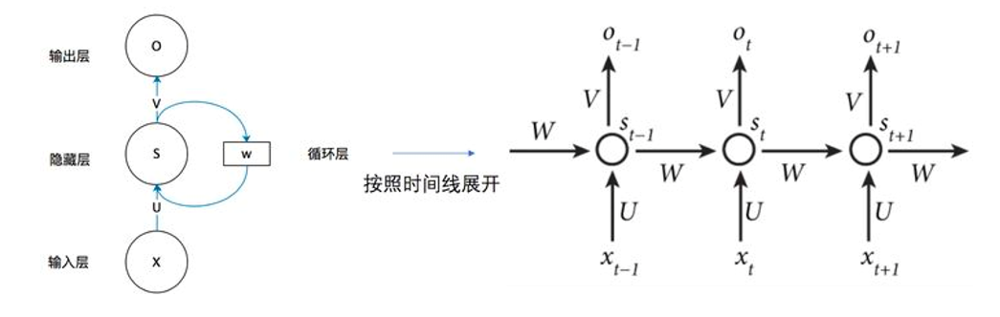
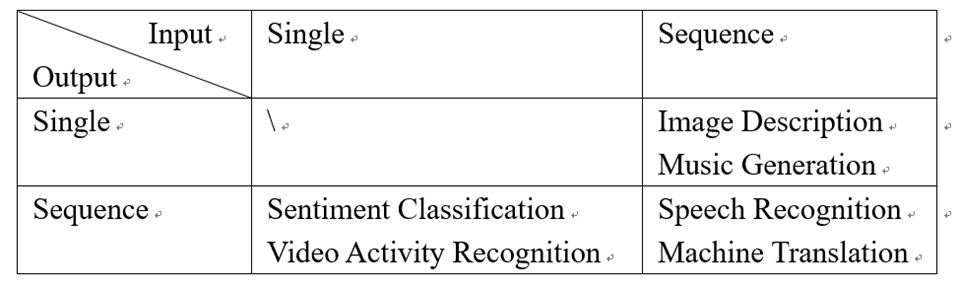
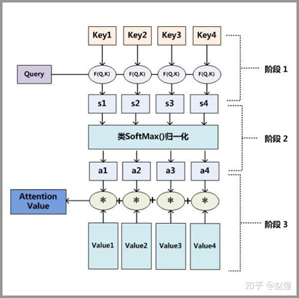
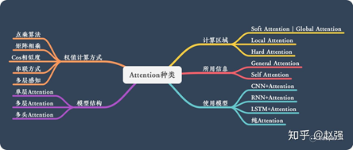
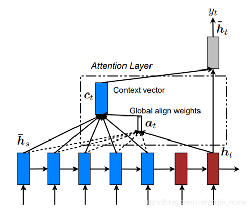
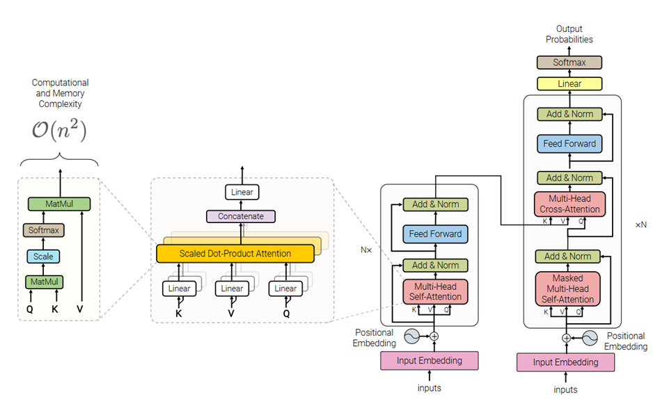

# Sequence Model

> 汇报人：魏 洁      日期：2021-11-15

## 1. Recurrent Neural Network

### 1.1 Why RNN?

CNN 针对输入序列是单独处理每一个输入单元的信息（token、frame），前一个输入和后一个输入是完全没有关系的。但是，面向序列数据的大多数任务都是需要考虑上下文信息，这样才能更好的处理序列的信息，得到有效分析。

### 1.2 RNN 结构

$x$ 是一个向量，它表示输入层的值； $s$ 是一个向量，它表示隐藏层的值； $o$ 是一个向量，它表示输出层的值；

$U$ 是输入层到隐藏层的权重矩阵; $V$ 是隐藏层到输出层的权重矩阵; $W$ 是隐藏层上一时刻的值作为当前时刻隐藏层输入的权重矩阵。

公式表示为：

$$
\begin{aligned} &O_{t}=g(V\cdot S_{t})  \\ &S_{t}=f(U\cdot X_{t}+W\cdot S_{t-1}) \end{aligned}
$$

### 1.3 RNN 变体

RNN 存在的问题：长距离的信息无法进行有效的传递，进而造成远距离的梯度值非常小，逐步出现**梯度消失**，最后导致网络无法更新参数，因此不适用于处理长文本。

RNN 是一种死板的逻辑，越晚的输入影响越大，越早的输入影响越小，且无法改变这个逻辑。为了打破这个逻辑，提出一套灵活逻辑只保留重要的信息。

LSTM & GRU 提出，解决上述存在的问题。

## 2. Sequence-to-sequence Learning

### 2.1 Task

根据输入和输出数据的类别，可以将任务划分为一下几大类：

RNN 输出的序列长度与输入序列长度保持一致，不能任意变化；单纯使用 RNN 无法灵活处理上述问题。

### 2.2 Seq2Seq

seq2seq 可以看作由 Encoder 和 Decoder 两个部分组成，Encoder 将一个序列编码为一个固定长度的语义向量，Decoder 将该语义向量解码为另一个序列。

Encoder 端：

$$
\begin{aligned}
&h_{t}=\tanh \left(W\left[h_{t-1}, x_{t}\right]+b\right) \\
&o_{t}=\operatorname{softmax}\left(V h_{t}+b\right) \\
&c=\tanh \left(U h_{T}\right)
\end{aligned}
$$

其中，$h_{t}$是隐藏状态，$o_{t}$是输出，$c$是语义向量，$h_{T}$是 Encoder 整个序列的隐藏状态

Decoder 端：两种形式

| Name      | Structure                                 | Formula                                                      |
| --------- | ----------------------------------------- | ------------------------------------------------------------ |
| Cho       |  | $h_{t}=tanh(W[h_{t-1},y_{t-1},c]+b)$ $o_{t}=softmax(Vh_{t}+b)$ |
| Sutskever |  | $h_{t}=tanh(W[h_{t-1},y_{t-1}]+b)$  $o_{t}=softmax(Vh_{t}+b)$ $h_{0}=c$ |

## 3. Attention Mechanism

### 3.1 动机

- seq2seq 框架用 Encoder 将输入序列编码成一个语义向量，这个过程是对信息压缩的过程，不可不免地会损失很多信息；为了 Decoder 可以充分利用编码端完整的数据信息，减少信息损失。在生成每个时刻的$y$，都会利用到编码端的$x1,x2,x3{...}$，而不再仅仅利用最后时刻的隐藏状态向量。
- 同一场景，不同的人或任务会有不同的关注对象，也会有不同的关注时刻。

### 3.2 原理

涉及三个主要概念：Key、Value、Query。 可以理解为：图书馆（source）有很多书（value），每本书都有自己的编号（key），当我们想了解关于 AI 编程（query）方面的内容时，并不是所有书都仔细看，我们就主要关注其中相关的书籍（value2 和 value5)。

attention 计算主要分为三步：

1. query 和 key 进行相似度计算，得到权值

$$
s\left(q_{t}, k_{s}\right)=W [q_{t}, k_{s}]
$$

2. 将权值进行归一化，得到直接可用的权重

$$
a\left(q_{t}, k_{s}\right)=\frac{\exp \left(s\left(q_{t}, k_{s}\right)\right)}{\sum_{i=1}^{N} \exp \left(s\left(q_{t}, k_{i}\right)\right)}
$$

3. 将权重和 value 进行加权求和

$$
\text { Attention }\left(q_{t}, K, V\right)=\sum_{s=1}^{m} a\left(q_{t}, k_{s}\right) v_{s}
$$

### 3.3 种类

### 3.4 Seq2Seq 中常用的两种 Attention

| Name     | Structure                                 | Formula                                                      |
| -------- | ----------------------------------------- | ------------------------------------------------------------ |
| Bahdanau |  | 1) Context vector  $\begin{aligned} &c_{t}=\sum_{i=1}^{T} \alpha_{t i} h_{i} \\ &\alpha_{t i}=\frac{\exp \left(e_{t i}\right)}{\sum_{k=1}^{T} \exp \left(e_{t k}\right)} \\ &e_{t i}=v_{a}^{\top} \tanh \left(W_{a}\left[s_{i-1}, h_{i}\right]\right) \end{aligned}$  2) Hidden layer parameters    $s_{t}=\tanh \left(W\left[s_{t-1}, y_{t-1}, c_{t}\right]\right)$ $o_{t}=\operatorname{softmax}\left(V s_{t}\right)$ |
| Luong    |  | 1) Hidden layer parameters  $s_{t}=\tanh \left(W\left[s_{t-1}, y_{t-1}\right]\right)$   2) Context vector   $c_{t}=\sum_{i=1}^{T} \alpha_{t i} h_{i}$ $\alpha_{t i}=\frac{\exp \left(e_{t i}\right)}{\sum_{k=1}^{T} \exp \left(e_{t k}\right)}$ $e_{t i}=s_{t}^{\top} W_{a} h_{i}$  3) Hidden layer parameters  $\tilde{s}_{t}=\tanh \left(W_{c}\left[s_{t}, c_{t}\right]\right)$  $o_{t}=\operatorname{softmax}\left(V \tilde{s}_{t}\right)$ |

## 4. Transformer

### 4.1 整体结构

cross-attention：通过 target 中的 query 和 source 中的所有 value 求得的，学习的是 target 中的每个元素和 source 中的所有元素的相关度；

self-attention：只使用 source 内部信息，key 和 value 以及 query 只和输入原文有关，key=value=query，学习 source 本身的每个元素和其他元素的相似度。

### 4.2 Multi-head Attention

动机：

类比 CNN 中同时使用**多个滤波器**的作用，其核心思想在于，抽取到更加丰富的**特征信息**。希望每个注意力头，只关注最终输出序列中一个子空间，互相**独立**。

实现：

把 query 和 key 映射到高维空间 $\alpha$ 的不同子空间 $\left(\alpha_{1}, \alpha_{2}, \ldots, \alpha_{h}\right)$ 中去计算相似度。 具体而言：如果是 _N_ 头注意力，则将高维空间维度划分 _N_ 份，形成 _N_ 个子空间，每个子空间进行 attention 计算，最后合并不同子空间的 attention 信息。

优势：

- 在参数总量保持不变的情况下，降低了计算每个 head 的 attention 时每个向量的维度，降低整体计算量；
- 由于 Attention 在不同子空间中有不同的分布，Multi-head Attention 实际上是寻找了序列之间不同角度的关联关系，增强了表现力。

## 5. Reference

Paper:

[1] Cho K, Van Merriënboer B, Gulcehre C, et al. Learning phrase representations using RNN encoder-decoder for statistical machine translation[J]. arXiv preprint arXiv:1406.1078,2014.

[2] Sutskever I, Vinyals O, Le Q V. Sequence to sequence learning with neural networks[C]//Advances in neural information processing systems. 2014:3104-3112.

[3] Bahdanau D, Cho K, Bengio Y. Neural machine translation by jointly learning to align and translate[J]. arXiv preprint arXiv:1409.0473,2014.

[4] Luong M T, Pham H, Manning C D. Effective approaches to attention-based neural machine translation[J]. arXiv preprint arXiv:1508.04025,2015.

[5] Vaswani A, Shazeer N, Parmar N, et al. Attention is all you need[C]//Advances in neural information processing systems. 2017:5998-6008.

Blog:

 [一文搞懂 RNN（循环神经网络）基础篇 - 知乎](https://zhuanlan.zhihu.com/p/30844905)

 [一文看懂循环神经网络 RNN（2 种优化算法+5 个实际应用）](https://easyai.tech/ai-definition/rnn)

[音视频序列数据分析（RNN-＞seq2seq-＞Encoder+Decoder-＞Attention-＞Transformer）_小幸运-CSDN博客](https://blog.csdn.net/weijie_home/article/details/116407137)

Github:

[GitHub - pprp/awesome-attention-mechanism-in-cv: 计算机视觉中用到的注意力模块和其他即插即用模块PyTorch Implementation Collection of Attention Module and Plug&Play Module](https://github.com/pprp/awesome-attention-mechanism-in-cv)
