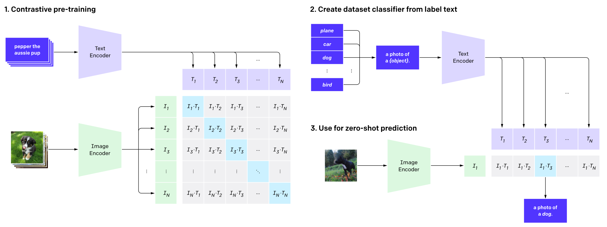
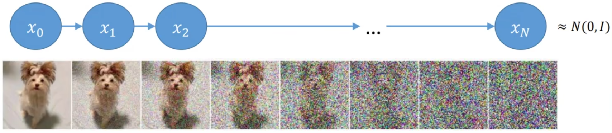

# Diffusion Model 扩散模型

==😎 Edited at 2022-11-04 by **Song1xinn**==

## 1. Introduce

### 1.1 DALL·E 2

> DALL·E2：https://openai.com/dall-e-2/	DALL·E mini：https://huggingface.co/spaces/dalle-mini/dalle-mini	Imagen / Parti - Google

==DALL·E 2==   CLIP + diffusion model

==CLIP==  

> 1️⃣CLIP pre-trains an image encoder and a text encoder to predict which images were paired with which texts in our dataset.  2️⃣Then use this behavior to turn CLIP into a **zero-shot** **classifier**.  3️⃣Convert all of a dataset’s classes into captions such as “a photo of a *dog*” and **predict the class of the caption** with a given image.

### 1.2 Generation Models

## 2. What's Diffusion Model

前提：所有的图像都满足自然中的分布（distribution），比如所有带有小猫的图都遵循一种分布、所有带有小狗的图都遵循一种分布。

### 2.1 Forward diffusion process（Training Process ONLY）

> Given a data point sampled from a real data distribution $ x_0∼q(x)$, let us define a ***forward diffusion process*** in which we add small amount of **Gaussian noise** to the sample in $T$ steps, producing a sequence of noisy samples $x_1,…,x_T$.  The data sample $ x_0$ gradually loses its distinguishable features as the step $t$ becomes larger. Eventually when $ T→∞$, $x_T $ is equivalent to an isotropic Gaussian distribution.

**目标：** $q(x_T|x_0)$

给定如下公式，其中 $ {β_t∈(0,1)}_{t=1}^T$，可以理解为添加的噪声的占比，是自定的函数，所以可以看作已知量。
$$
\alpha_t = 1-\beta_t
$$

那么，如果已知 $x_{t-1}$ ，我们设定 $x_t$ 为下述公式，其中 $\epsilon_t$ 表示时刻 $t$ 加的噪声：
$$
x_t = \sqrt{\alpha_t}x_{t-1} + \sqrt{1-\alpha_t}\epsilon_t\label{2}
$$
同理， $x_{t-1}$ 可以由 $x_{t-2}$ 表示，再由于每一次添加噪声都是从高斯分布中采样的噪声，即 $\epsilon_t∼N(0,\boldsymbol I)$ ，基于此，我们还能推理得到 $x_t$ 与 $x_{t-2}$ 的关系，其中 $\epsilon$ 合并了两个高斯分布：
$$
x_{t} = \sqrt{\alpha_t}(\sqrt{\alpha_{t-1}}x_{t-2} + \sqrt{1-\alpha_{t-1}}\epsilon_{t-1})+ \sqrt{1-\alpha_t}\epsilon_t
\\ = \sqrt{\alpha_t}\sqrt{\alpha_{t-1}}x_{t-2} + \sqrt{\alpha_t}\sqrt{1-\alpha_{t-1}}\epsilon_{t-1}+ \sqrt{1-\alpha_t}\epsilon_t
\\ =\sqrt{\alpha_t\alpha_{t-1}}x_{t-2} + \sqrt{1-\alpha_t\alpha_{t-1}} \epsilon
$$

> ==**数学解释**==
>
> * 关于 $\epsilon_t$ 的高斯分布可以写作：$\epsilon_t∼N(0,\sigma_1^2)$，乘上 $ w$ 后方差变为 $\sigma_1^2 * w^2$，加上 $b$ 后均值变为 $0+b$ 。
> * 如果两个相互独立的高斯分布$\epsilon_1∼N(\mu_1,\sigma_1^2), \epsilon_2∼N(\mu_2,\sigma_2^2)$，那么$\epsilon = (a\epsilon_1 ± b\epsilon_2)∼N(a\mu_1±b\mu_2,a^2\sigma_1^2+b^2\sigma_2^2)$
> * 现在有两个高斯分布 ： $\sqrt{\alpha_t(1-\alpha_{t-1})}\epsilon_{t-1}∼N(0,\alpha_t(1-\alpha_{t-1})) $，$\sqrt{1-\alpha_t}\epsilon_t∼N(0,1-\alpha_t) $
>   两个分布相加可以得到：$\sqrt{\alpha_t(1-\alpha_{t-1})}\epsilon_{t-1} + \sqrt{1-\alpha_t}\epsilon_t ∼N(0,1-\alpha_t\alpha_{t-1})$ 

可以推理得到 $x_t$ 与 $x_0$ 的关系，其中 $\bar\alpha_t$ 表示累乘：
$$
x_{t} =\sqrt{\bar\alpha_t}x_{0} + \sqrt{1-\bar\alpha_t}\epsilon\label{4}
$$
==回到概率分析==  

给定初始的数据分布 $x_0 ∼ q(x)$，可以不断地向分布中添加高斯噪声，该噪声的方差以固定值 $\beta_t$ 确定，均值以 $\beta_t$ 和当前时刻 $t$ 的数据 $x_t$ 决定。基于前一时刻去预测后一时刻是一个条件概率分布，给定 $x_0$ ， $x_1$ 到 $x_T$ 的联合概率分布可以写为条件概率分布相乘：
$$
q(x_{1:T}|x_{0}) = \prod^T_{t=1} q(x_t|x_{t-1}) \qquad q(x_t|x_{t-1}) = N(x_t; \sqrt{1-\beta_t}x_{t-1},\beta_t\boldsymbol I)\label{11}
$$
公式 $\eqref{11}$ 中可以看出这个分布的均值是 $\sqrt{1-\beta_t}x_{t-1}$ ，方差是 $\beta_t$ ，可以得到由 $x_{t-1}$ 表示的 $x_t$，也就是公式 $\eqref{2}$ 。和前面的推理原理相同，通过对高斯分布的相加，得到 $x_t$ 关于 $x_0$ 的条件概率分布。
$$
q(x_t|x_0) = N(x_t; \sqrt{\bar\alpha_t}x_0,(1-\bar\alpha_t)\boldsymbol I)
$$
随着 $t$ 的不断增大，当 $T \to \infty  $，最终数据分布 $x_T$ 变成了一个各向独立的高斯分布。
注意，前向过程不包括任何需要学习的参数。

==🤔Question==  **Why forward diffusion process ？**

### 2.2 Reverse diffusion process

> if we can reverse the above process and sample from $q(x_{t−1}|x_t)$, we will be able to recreate the true sample from a Gaussian noise input, $x_T∼N(0,I)$. Note that if $β_t$ is small enough, $q(x_{t−1}|x_t)$ will also be Gaussian. Unfortunately, we cannot easily estimate $q(x_{t−1}|x_t)$ because it needs to use the entire dataset and therefore we need to learn a **model $p_θ$** to approximate these conditional probabilities in order to run the *reverse diffusion process*.

**目标：** $p_\theta(x_0|x_T)$

逆过程是从高斯噪声中回复原始数据，所以可以假设其也是一个高斯分布，在这里需要构建一个模型 $p_\theta$ 来通过给定的噪声来预测出训练集的分布，从而可以通过从分布中采样来生成新的样本。
$$
p_\theta(x_{0:T}) =p(x_T) \prod^T_{t=1} p_\theta(x_{t-1}|x_{t}) \qquad p_\theta(x_{t-1}|x_{t}) = N(x_{t-1}; \mu_\theta(x_t,t),\Sigma_\theta(x_t,t))\label{13}
$$
由于反向过程没办法直接求得 $x_0$ 与 $x_t$ 之间的关系，即无法直接从噪声到图像，那么我们转换方式，我们可以先求 $x_{t-1}$，$x_{t-2}$ ... 直到得到$x_{0}$，即先求 $q(x_{t-1}|x_t)$ ，再进一步建模。若给定 $x_t, x_0$ 后验扩散条件概率 $q(x_{t-1}|x_t,x_0) $分布用公式表达：
$$
q(x_{t-1}|x_t,x_0)  = N(x_{t-1};\tilde\mu_t(x_t,x_0),\tilde\beta_t\boldsymbol I)
$$
根据贝叶斯公式，有：
$$
q(x_{t-1}|x_t,x_0) = q(x_{t}|x_{t-1},x_0)\frac{q(x_{t-1},x_0)}{q(x_t,x_0)}\\
$$
将上式用分布表示，同时进行展开
$$
(9)\;∝exp⁡(−\frac{1}{2}(\frac{(x_t−\sqrt{α_t}x_{t−1})^2}{β_t} + \frac{(x_{t−1}−\sqrt{α_{t−1}}x_0)^2}{1−\barα_{t−1}}−\frac{x_t−\sqrt{\barα_t}x_0)^2}{1−\barα_t}))\\
= exp⁡(−\frac{1}{2}(\frac{x_t^2−2\sqrtα_tx_tx_{t−1}+α_tx_{t−1}^2}{βt}+\frac{x_{t−1}^2−2\sqrt{\barα_{t−1}}x_0x_{t−1}+\barα_{t−1}x_0^2}{1−\barα_{t−1}}−\frac{(x_t−\sqrt{\barα_t}x_0)^2}{1−\barα_t}))\\
=exp⁡(−\frac{1}{2}((\frac{α_t}{β_t}+\frac{1}{1−\barα_{t−1}})x_{t−1}^2−(\frac{2\sqrtα_t}{β_t}x_t+\frac{2\barα_{t−1}}{1−\barα_{t−1}}x_0)x_{t−1}+C(x_t,x_0)))\label{7}
$$

> ==**数学解释**==
>
> * 根据前向过程，可以得到：
>   $q(x_{t}|x_{t-1},x_0) = \sqrt\alpha_tx_{t-1}+\sqrt{1-\alpha_t}\epsilon ∼N(\sqrt\alpha_tx_{t-1},1-\alpha_t)$
>   $ {q(x_{t-1},x_0)} = \sqrt{\bar\alpha_{t-1}}x_{0}+\sqrt{1-\bar\alpha_{t-1}}\epsilon ∼N(\sqrt{\bar\alpha_{t-1}}x_{0},1-\bar\alpha_{t-1})$
>   $ {q(x_t,x_0)}=\sqrt\alpha_tx_{0}+\sqrt{1-\bar\alpha_{t}}\epsilon∼N(\sqrt\alpha_tx_{0},1-\bar\alpha_{t})$
>
> * 高斯分布的概率密度函数： $ f(x) = \frac{1}{\sqrt{2\pi}\sigma}exp({-\frac{1}{2}(\frac{x-\mu}{\sigma})^2})$ ，于是有 $N(\mu, \sigma^2) \propto exp({-\frac{1}{2}(\frac{x-\mu}{\sigma})^2})$，展开后在 $exp$ 中，乘法就是相加，除法就是相减。

又因为  $exp({-\frac{1}{2}(\frac{x-\mu}{\sigma})^2}) = exp(-\frac{1}{2}(\frac{1}{\sigma^2}x^2-\frac{2\mu}{\sigma^2}x+ \frac{\mu^2}{\sigma^2}))$ ，所以根据 $\eqref{7}$ 可以得到关于 $x_{t-1}$ 的分布方差和均值：
$$
\tilde\beta_t = \frac{1}{(\frac{α_t}{β_t}+\frac{1}{1−\barα_{t−1}})} = \frac{1−\barα_{t−1}}{1−\barα_{t}} \cdot \beta_t
\\\tilde\mu_t(x_t,x_0) = \frac{\sqrt\alpha_t(1-\bar\alpha_{t-1})}{1-\bar\alpha_{t}}x_t+ \frac{\sqrt{\bar\alpha_{t-1}}\beta_t}{1-\bar\alpha_{t}}x_0\label{8}
$$
由于当前的已知是 $x_t$ ，在前向过程中推理了 $x_t$ 与 $x_0$ 的关系 ，那么利用公式 $\eqref{4}$ 将 $x_0$ 用 $x_t$ 来近似，有：
$$
x_0 =\frac{1}{\sqrt{\bar\alpha_t}}(x_t-\sqrt{1-\bar\alpha_t}\epsilon_t)
$$

$$
\tilde\mu_t = \frac{1}{\sqrt\alpha_t}(x_t-\frac{\beta_t}{\sqrt{1-\bar\alpha_t}}\epsilon_t)
$$

==🧐Question==  **How to get $\boldsymbol{\epsilon_t}$ ？**    🙌*Train a model to predict it.*

### 2.3 Algrithms

#### 2.3.1 Training (Predict the noise)

| Algrithm 1 Training                                          | Note                                                         |
| ------------------------------------------------------------ | ------------------------------------------------------------ |
| 1: **repeat**                                                |                                                              |
| 2:     $x_0 ∼ q(x_0)$                                        | $x_0$ 为分布 $q$ 中随机采样的图像（数据集中取数据）          |
| 3:     $t ∼ Uniform(\{1,...,T\})$                            | $ t$ 即扩散次数，从 $0$ 到 $T$，对不同的图像是不固定的       |
| 4:     $\epsilon ∼ N(0, I)$                                  | $\epsilon$ 高斯分布 $N(0, I)$ 中随机采样的噪声（从前向过程获得） |
| 5:     Take gradient descent step on  $\gradient_\theta ‖ϵ−ϵ_θ(\sqrt{\bar α_t}x_0+\sqrt{1−\bar α_t}ϵ,t)‖^2 $ | $ϵ_θ$ 即训练的模型，括号内是输入：时间以及 $x_t$             |
| 6: **until** converged                                       |                                                              |

#### 2.3.2 Sampling (To get $x_0$) 

| Algrithm 2 Sampling                                          | Note                                                         |
| ------------------------------------------------------------ | ------------------------------------------------------------ |
| 1: $x_T ∼ N(0, I)$                                           | $x_T$ 高斯分布 $N(0, I)$ 中随机采样的噪声                    |
| 2: **for** $t = T,...,1 $ **do**                             |                                                              |
| 3:     $z ∼ N(0, I)$ **if** $t>1$ , **else** $z = 0$         | $ t = 1$ 即 $x_0$ 时刻没有噪声，其他时刻都有从分布中采样的噪声（重参数） |
| 4:     $x_{t-1} = \frac{1}{\sqrt\alpha_t}(x_t-\frac{1-\alpha_t}{\sqrt{1-\bar\alpha_t}}\epsilon_\theta(x_t, t)) + \sigma_tz$ |                                                              |
| 5:     **end for**                                           |                                                              |
| 6: **return** $x_0$                                          |                                                              |

## 3. Code

* diffusion model demo
* diffusion in DALL·E 2 （image generation）

## References:

[1] Radford A, Kim J W, Hallacy C, et al. Learning transferable visual models from natural language supervision[C]//International Conference on Machine Learning. PMLR, 2021: 8748-8763.
[2] **Ho J, Jain A, Abbeel P. Denoising diffusion probabilistic models[J]. Advances in Neural Information Processing Systems, 2020, 33: 6840-6851.**
[3] https://openai.com/dall-e-2/
[4] https://huggingface.co/spaces/dalle-mini/dalle-mini
[5] https://lilianweng.github.io/posts/2021-07-11-diffusion-models/
[6] https://www.bilibili.com/video/BV1b541197HX/?spm_id_from=333.788&vd_source=7020551ede7e34125c5de7acc9417f8d
[7] https://www.bilibili.com/video/BV1tY4y1N7jg/?spm_id_from=333.788.recommend_more_video.1&vd_source=7020551ede7e34125c5de7acc9417f8d
[8] https://github.com/heejkoo/Awesome-Diffusion-Models
[9] https://www.bilibili.com/video/BV1ad4y1c7vY/?spm_id_from=333.337.search-card.all.click&vd_source=7020551ede7e34125c5de7acc9417f8d

